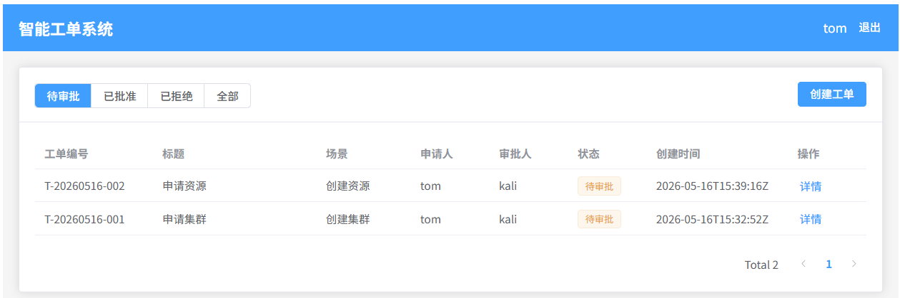
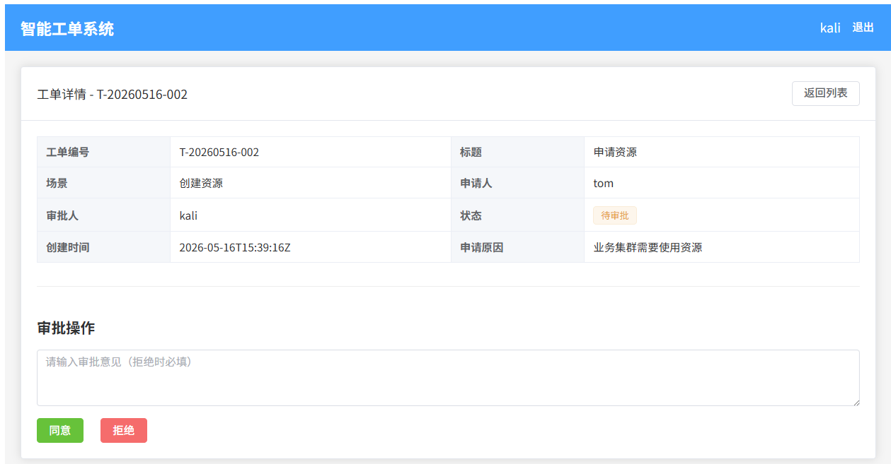
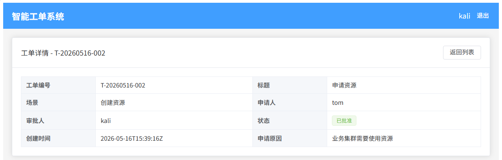

# AI Ticket - 智能工单审批系统

基于MCP协议的智能工单审批系统，支持Web界面和AI助手两种方式管理工单，结合Skill实现自动化审批提效。

## 产品使用介绍

### 1 前端界面展示
工单列表界面



审批界面



审批结果界面




### 2 Skill + MCP 对话自动审批工单

1. 配置 MCP Server
```json
{
  "mcpServers": {
    "ai-ticket": {
      "command": "go",
      "args": [
        "run",
        ".\\cmd\\mcp-server\\main.go" 
      ],
      "env": {
        "TICKET_TOKEN": "xxxx" 
      },
      "type": "stdio"
    }
  }
}
```
设置本地运行目录 + 登录用户Token
2. 测试MCP


## 功能特性

- 用户注册/登录（JWT认证）
- 工单创建、查询、审批
- 支持stdio和HTTP/SSE两种MCP传输模式
- Vue 3 前端界面
- SQLite轻量级存储

## 架构设计

### 整体架构

```
┌─────────────────────────────────────────────────────────────────────────────┐
│                              用户交互层                                      │
├─────────────────────────────┬───────────────────────────────────────────────┤
│      Web 前端 (Vue 3)       │           AI 助手 (Claude)                    │
│      http://localhost:5173  │           + Skill 规范                        │
└──────────────┬──────────────┴──────────────────────┬────────────────────────┘
               │                                      │
               ▼                                      ▼
┌─────────────────────────────┐    ┌─────────────────────────────────────────┐
│      REST API 服务           │    │         MCP Server (stdio/HTTP)         │
│      http://localhost:8080   │    │         提供3个原子工具                   │
│      - JWT 认证中间件         │    │         - list_pending_tickets          │
│      - 工单 CRUD 接口        │    │         - get_ticket_detail             │
│      - 审批流转接口           │    │         - review_ticket                 │
└──────────────┬──────────────┘    └──────────────────┬──────────────────────┘
               │                                      │
               └──────────────┬───────────────────────┘
                              ▼
┌─────────────────────────────────────────────────────────────────────────────┐
│                           Service 业务逻辑层                                 │
│                                                                             │
│   ┌─────────────┐  ┌─────────────┐  ┌─────────────┐  ┌─────────────┐       │
│   │ AuthService  │  │TicketService│  │  安全校验    │  │  权限控制    │       │
│   │  用户认证    │  │  工单管理    │  │  工单归属    │  │  审批人验证  │       │
│   └─────────────┘  └─────────────┘  └─────────────┘  └─────────────┘       │
└─────────────────────────────────────────────────────────────────────────────┘
                              │
                              ▼
┌─────────────────────────────────────────────────────────────────────────────┐
│                            数据存储层                                        │
│                                                                             │
│                          SQLite (tickets.db)                                │
│                    ┌──────────────┬──────────────┐                          │
│                    │   users 表   │  tickets 表   │                          │
│                    └──────────────┴──────────────┘                          │
└─────────────────────────────────────────────────────────────────────────────┘
```

### 核心分层

| 层级 | 职责 | 技术实现 |
|------|------|----------|
| **交互层** | 用户输入输出 | Vue 3 前端 + Claude AI + Skill |
| **接入层** | 协议适配 | REST API (Gin) + MCP Server (mcp-go) |
| **业务层** | 核心逻辑 | Service 层，REST/MCP 共享复用 |
| **存储层** | 数据持久化 | SQLite + database 包 |

### MCP + Skill 协作模型

```
┌─────────────────────────────────────────────────────────────────┐
│                        Claude AI 助手                           │
│                                                                 │
│  ┌───────────────────────────────────────────────────────────┐  │
│  │                    Skill 规范层                            │  │
│  │  - 定义审批流程规范                                        │  │
│  │  - 约束操作顺序（先查后审）                                 │  │
│  │  - 定义自动审批规则                                        │  │
│  └───────────────────────────────────────────────────────────┘  │
│                              │                                  │
│                              ▼                                  │
│  ┌───────────────────────────────────────────────────────────┐  │
│  │                    MCP 工具层                              │  │
│  │  - list_pending_tickets: 查询待审批工单                    │  │
│  │  - get_ticket_detail: 获取工单详情                         │  │
│  │  - review_ticket: 执行审批操作                             │  │
│  └───────────────────────────────────────────────────────────┘  │
└─────────────────────────────────────────────────────────────────┘
```

**职责划分：**
- **MCP Server**：纯工具层，提供原子操作能力，负责安全校验
- **Skill 文件**：使用指南，定义审批流程规范和自动审批规则
- **策略配置**：由用户/部门自定义，MCP服务不感知

## 设计优点

### 1. 关注点分离

```
┌─────────────────────────────────────────────────────────────────┐
│                      关注点分离架构                               │
├─────────────────────────────────────────────────────────────────┤
│                                                                 │
│   MCP Server (工具层)          Skill (规范层)                    │
│   ┌─────────────────┐         ┌─────────────────┐              │
│   │ - 原子操作能力   │         │ - 流程规范定义   │              │
│   │ - 安全校验      │         │ - 操作顺序约束   │              │
│   │ - 权限验证      │         │ - 自动审批规则   │              │
│   └─────────────────┘         └─────────────────┘              │
│          │                            │                        │
│          └──────────┬─────────────────┘                        │
│                     ▼                                          │
│          ┌─────────────────┐                                   │
│          │   Service 层    │  ← 业务逻辑共享复用                │
│          │   (REST + MCP)  │                                   │
│          └─────────────────┘                                   │
│                                                                 │
└─────────────────────────────────────────────────────────────────┘
```

- **MCP 只做工具**：提供原子操作，不包含业务流程逻辑
- **Skill 只做规范**：定义如何使用工具，不实现具体功能
- **Service 层复用**：REST API 和 MCP 共享同一套业务逻辑

### 2. 安全机制完善

| 安全层级 | 机制 | 说明 |
|----------|------|------|
| **认证层** | JWT Token | 用户身份验证，支持过期机制 |
| **权限层** | 工单归属校验 | 只能审批分配给自己的工单 |
| **流程层** | 先查后审 | Skill 规范强制先查看详情再审批 |
| **审计层** | 审批意见 | 拒绝时必须说明原因 |

### 3. 灵活的传输模式

```
stdio 模式（本地开发）                 HTTP/SSE 模式（生产部署）
┌─────────────────┐                   ┌─────────────────┐
│   Claude Code   │                   │   Web Client    │
│   + MCP Config  │                   │   + MCP Client  │
└────────┬────────┘                   └────────┬────────┘
         │ stdio                                │ HTTP
         ▼                                      ▼
┌─────────────────┐                   ┌─────────────────┐
│   MCP Server    │                   │   MCP Server    │
│   (子进程)      │                   │   (独立服务)    │
└─────────────────┘                   └─────────────────┘
```

### 4. 轻量级部署

- **SQLite**：无需独立数据库服务，单文件存储
- **Go 单二进制**：编译后无依赖，部署简单
- **Docker 支持**：一键容器化部署

### 5. 可扩展设计

```
┌─────────────────────────────────────────────────────────────────┐
│                      可扩展的工具集架构                          │
│                                                                 │
│   ┌─────────────────────────────────────────────────────────┐  │
│   │                   RegisterAllTools()                    │  │
│   │                                                         │  │
│   │   ┌─────────────┐  ┌─────────────┐  ┌─────────────┐    │  │
│   │   │TicketTools  │  │MonitorTools │  │ ScaleTools  │    │  │
│   │   │  (已有)     │  │  (规划中)   │  │  (规划中)   │    │  │
│   │   └─────────────┘  └─────────────┘  └─────────────┘    │  │
│   │                                                         │  │
│   └─────────────────────────────────────────────────────────┘  │
│                                                                 │
│   新增工具只需：                                                 │
│   1. 实现 ToolSet 接口                                          │
│   2. 在 RegisterAllTools() 中注册                               │
│                                                                 │
└─────────────────────────────────────────────────────────────────┘
```

## MCP + Skill 自动审批提效

### 传统审批 vs AI 自动审批

```
传统审批流程（人工操作）：
┌─────────┐    ┌─────────┐    ┌─────────┐    ┌─────────┐
│ 收到通知 │───▶│ 登录系统 │───▶│ 查看详情 │───▶│ 判断审批 │───▶ 完成
│  (邮件)  │    │  (Web)  │    │  (逐个)  │    │  (人工)  │
└─────────┘    └─────────┘    └─────────┘    └─────────┘
     │              │              │              │
     ▼              ▼              ▼              ▼
   5分钟         2分钟          5分钟/个        2分钟/个
                                    │
                                    ▼
                           总计：14分钟/个工单

AI 自动审批流程：
┌─────────┐    ┌─────────────────────────────────────┐
│ 用户指令 │───▶│  Claude + Skill + MCP 自动执行      │───▶ 完成
│  (一句话) │    │  - 批量查询待审批工单                │
└─────────┘    │  - 按规则自动匹配                    │
     │         │  - 批量执行审批                      │
     ▼         │  - 结果汇总汇报                      │
   10秒        └─────────────────────────────────────┘
                    │
                    ▼
           总计：30秒/批量工单
```

### 效率提升数据

| 场景 | 传统方式 | AI 自动审批 | 提效倍数 |
|------|----------|-------------|----------|
| 单个工单审批 | 14分钟 | 30秒 | **28x** |
| 10个工单批量审批 | 140分钟 | 1分钟 | **140x** |
| 日常巡检审批 | 30分钟 | 30秒 | **60x** |

### 自动审批工作流

```
┌─────────────────────────────────────────────────────────────────┐
│                    自动审批执行流程                               │
│                                                                 │
│  1. 用户触发                                                    │
│     ┌─────────────────────────────────────────────────────┐    │
│     │ "帮我按照自动审批规则处理待审批工单"                    │    │
│     └─────────────────────────────────────────────────────┘    │
│                           │                                     │
│                           ▼                                     │
│  2. Skill 解析规则                                              │
│     ┌─────────────────────────────────────────────────────┐    │
│     │ 读取 skill/auto-approval.md                         │    │
│     │ - 规则1: 创建集群 → 自动批准                          │    │
│     │ - 规则2: 创建资源 → 自动批准                          │    │
│     │ - 规则3: 测试工单 → 自动拒绝                          │    │
│     └─────────────────────────────────────────────────────┘    │
│                           │                                     │
│                           ▼                                     │
│  3. MCP 执行                                                    │
│     ┌─────────────────────────────────────────────────────┐    │
│     │ list_pending_tickets() → 获取待审批列表               │    │
│     │         │                                            │    │
│     │         ▼                                            │    │
│     │ 逐条匹配规则 → 执行 review_ticket()                  │    │
│     └─────────────────────────────────────────────────────┘    │
│                           │                                     │
│                           ▼                                     │
│  4. 结果汇报                                                    │
│     ┌─────────────────────────────────────────────────────┐    │
│     │ ✅ 自动批准：3个工单                                  │    │
│     │ ❌ 自动拒绝：1个工单                                  │    │
│     │ ⏭️ 跳过（需手动）：2个工单                            │    │
│     └─────────────────────────────────────────────────────┘    │
│                                                                 │
└─────────────────────────────────────────────────────────────────┘
```

### 自动审批规则示例

在 `skill/auto-approval.md` 中定义规则：

```markdown
## 规则定义

### 规则1：创建集群 - 自动批准
**匹配条件：**
- 场景 = "创建集群"

**执行动作：**
- 动作：agree
- 原因：创建集群符合规范，自动批准

### 规则2：低优先级扩容 - 自动批准
**匹配条件：**
- 场景 = "扩容"
- 优先级 = "low"

**执行动作：**
- 动作：agree
- 原因：低优先级扩容，自动批准

### 规则3：测试工单 - 自动拒绝
**匹配条件：**
- 标题包含 "测试" 或 "test"

**执行动作：**
- 动作：disagree
- 原因：测试工单不予审批，请撤销后重新提交
```

### 使用示例

#### 场景1：查询待审批工单

```
用户: 使用 cloud-ticket MCP 帮我查询下我现在有多少待审批工单

AI: 调用 list_pending_tickets(status="pending", filter="my_approve")

结果:
┌──────────────┬─────────────────────────────┬────────┬──────────┐
│ 工单ID       │ 标题                        │ 场景   │ 申请人   │
├──────────────┼─────────────────────────────┼────────┼──────────┤
│ T-20260516-005 │ 申请扩容-数据库服务-磁盘升级 │ 扩容   │ testuser │
│ T-20260516-002 │ 申请资源                    │ 创建资源│ tom     │
│ T-20260516-001 │ 申请集群                    │ 创建集群│ tom     │
└──────────────┴─────────────────────────────┴────────┴──────────┘
```

#### 场景2：手动审批单个工单

```
用户: 帮我通过工单 T-20260516-005

AI: 
1. 调用 get_ticket_detail(ticket_id="T-20260516-005") → 查看详情
2. 调用 review_ticket(ticket_id="T-20260516-005", action="agree", comment="同意扩容")

结果: 工单 T-20260516-005 已审批通过！
```

#### 场景3：自动审批批量处理

```
用户: 帮我按照自动审批规则处理待审批工单

AI: 按照 skill/auto-approval.md 规则执行...

结果:
自动审批执行完成：

✅ 自动批准：
- T-20260516-001: 申请集群 (申请人: tom)
  原因: 创建集群符合规范，自动批准

⏭️ 跳过（需手动审批）：
- T-20260516-002: 申请资源 (申请人: tom)
- T-20260516-005: 申请扩容-数据库服务 (申请人: testuser)
```

### 提效收益总结

| 维度 | 收益 |
|------|------|
| **时间成本** | 单工单审批从 14分钟 降至 30秒 |
| **批量处理** | 10个工单从 2.3小时 降至 1分钟 |
| **人力释放** | 审批人员可专注高价值决策 |
| **流程规范** | Skill 强制执行审批规范，减少人为疏漏 |
| **可追溯性** | 所有自动审批都有明确规则和原因记录 |

## 快速开始

### 前置条件

- Go 1.21+
- Node.js 18+
- npm 或 pnpm

### 后端启动

```bash
# 安装依赖
go mod tidy

# 启动API服务
go run ./cmd/api-server/
```

API服务启动在 http://localhost:8080

### 前端启动

```bash
# 进入前端目录
cd web

# 安装依赖
npm install

# 启动开发服务器
npm run dev
```

前端启动在 http://localhost:5173

### MCP服务启动

```bash
# 设置认证token
set TICKET_TOKEN=<your-jwt-token>

# 启动MCP服务
go run ./cmd/mcp-server/
```

## API接口

### 认证接口

| 方法 | 路径 | 说明 |
|-----|------|------|
| POST | `/api/auth/register` | 注册 |
| POST | `/api/auth/login` | 登录 |

### 工单接口

| 方法 | 路径 | 说明 |
|-----|------|------|
| GET | `/api/tickets` | 查询工单列表 |
| GET | `/api/tickets/:id` | 获取工单详情 |
| POST | `/api/tickets` | 创建工单 |
| POST | `/api/tickets/:id/approve` | 同意工单 |
| POST | `/api/tickets/:id/reject` | 拒绝工单 |

## MCP Tools

| 工具 | 说明 | 参数 |
|-----|------|------|
| `list_pending_tickets` | 查询待审批工单 | status, filter, page, page_size |
| `get_ticket_detail` | 获取工单详情 | ticket_id |
| `review_ticket` | 审批工单 | ticket_id, action, comment |

### MCP 配置

在 Claude Code 的 `~/.claude/settings.json` 中添加：

```json
{
  "mcpServers": {
    "ai-ticket": {
      "command": "go",
      "args": ["run", "D:\\project\\ai-ticket\\cmd\\mcp-server\\main.go"],
      "env": {
        "TICKET_TOKEN": "<your-jwt-token>"
      },
      "type": "stdio"
    }
  }
}
```

## Skill 文件

| 文件 | 说明 |
|------|------|
| `skill/ticket-approval.md` | 工单审批流程规范 |
| `skill/auto-approval-template.md` | 自动审批规则模板 |

### 使用自动审批

1. 复制模板：`cp skill/auto-approval-template.md skill/my-auto-approval.md`
2. 修改规则：根据业务需求定义匹配条件和执行动作
3. 触发执行：对 AI 说 "按照自动审批规则处理待审批工单"

## 项目结构

```
ai-ticket/
├── cmd/
│   ├── api-server/          # API服务入口
│   ├── mcp-server/          # MCP服务入口
│   └── mock-server/         # Mock服务（测试用）
├── internal/
│   ├── auth/                # JWT认证
│   ├── database/            # SQLite数据库
│   ├── handler/             # HTTP/MCP处理器
│   ├── middleware/           # 中间件
│   ├── model/               # 数据模型
│   ├── service/             # 业务逻辑层
│   └── ...
├── skill/                   # Skill 规范文件
│   ├── ticket-approval.md   # 审批流程规范
│   └── auto-approval-template.md  # 自动审批模板
├── web/                     # Vue 3 前端
│   ├── src/
│   ├── package.json
│   └── vite.config.ts
├── Dockerfile
└── docker-compose.yml
```

## Docker部署

```bash
# 构建并启动
docker-compose up -d

# 查看日志
docker-compose logs -f
```

## 测试

### 后端测试

```bash
go test ./...
```

### 前端测试

```bash
cd web
npm run dev
# 浏览器访问 http://localhost:5173
```

## License

MIT
